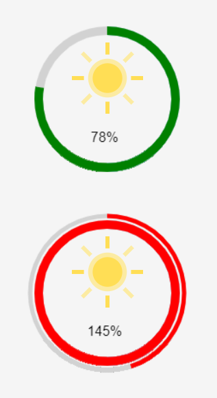

# cj-knob
=======

Simple jQuery canvas knob

## First step:
div with id and number
```
<div id="cjknob-1">78</div>
<div id="cjknob-2">145</div>
```
## Second step:
Including Jquery 1.8.1 and cjknob.js

## Third step:
Call JS
```
$("#cjknob-1").cjknob({ cColor : "green" });
$("#cjknob-2").cjknob({ cColor : "red" });
```

## Preview
